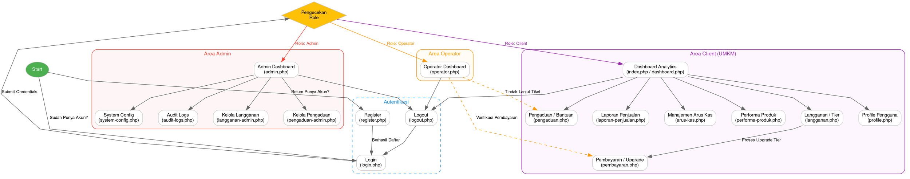

```dot
digraph UMKM_Insight_Workflow {
    // Pengaturan Umum Graf
    graph [fontname="Helvetica,Arial,sans-serif", fontsize=12, rankdir=TB, nodesep=0.5, ranksep=0.8, splines=polyline];
    node [fontname="Helvetica,Arial,sans-serif", fontsize=11, shape=box, style="rounded,filled", color="#cccccc", fillcolor="#ffffff"];
    edge [fontname="Helvetica,Arial,sans-serif", fontsize=10, color="#666666"];

    // Aktor / Entri Awal
    Start [shape=oval, fillcolor="#4CAF50", fontcolor="white", label="Start"];
    
    // Autentikasi
    subgraph cluster_auth {
        label="Autentikasi";
        style="dashed,rounded";
        color="#2196F3";
        fontcolor="#2196F3";
        Register [label="Register\n(register.php)"];
        Login [label="Login\n(login.php)"];
        Logout [label="Logout\n(logout.php)"];
    }

    // Role Distribution
    RoleCheck [shape=diamond, fillcolor="#FFC107", style=filled, label="Pengecekan\nRole"];

    // Client Workflow
    subgraph cluster_client {
        label="Area Client (UMKM)";
        style="solid,rounded";
        color="#9C27B0";
        fontcolor="#9C27B0";
        bgcolor="#fdf6fe";
        
        DashboardClient [label="Dashboard Analytics\n(index.php / dashboard.php)"];
        
        LaporanPenjualan [label="Laporan Penjualan\n(laporan-penjualan.php)"];
        ArusKas [label="Manajemen Arus Kas\n(arus-kas.php)"];
        PerformaProduk [label="Performa Produk\n(performa-produk.php)"];
        
        Langganan [label="Langganan / Tier\n(langganan.php)"];
        Pembayaran [label="Pembayaran / Upgrade\n(pembayaran.php)"];
        
        Pengaduan [label="Pengaduan / Bantuan\n(pengaduan.php)"];
        Profile [label="Profile Pengguna\n(profile.php)"];
    }

    // Operator Workflow
    subgraph cluster_operator {
        label="Area Operator";
        style="solid,rounded";
        color="#FF9800";
        fontcolor="#FF9800";
        bgcolor="#fffbf5";
        
        DashboardOperator [label="Operator Dashboard\n(operator.php)"];
    }

    // Admin Workflow
    subgraph cluster_admin {
        label="Area Admin";
        style="solid,rounded";
        color="#F44336";
        fontcolor="#F44336";
        bgcolor="#fef6f6";
        
        DashboardAdmin [label="Admin Dashboard\n(admin.php)"];
        SystemConfig [label="System Config\n(system-config.php)"];
        AuditLogs [label="Audit Logs\n(audit-logs.php)"];
        LanggananAdmin [label="Kelola Langganan\n(langganan-admin.php)"];
        PengaduanAdmin [label="Kelola Pengaduan\n(pengaduan-admin.php)"];
    }

    // Alur Logika (Flow)
    Start -> Login [label="Sudah Punya Akun?"];
    Start -> Register [label="Belum Punya Akun?"];
    Register -> Login [label="Berhasil Daftar"];
    
    Login -> RoleCheck [label="Submit Credentials"];
    
    // Autentikasi ke Role
    RoleCheck -> DashboardClient [label="Role: Client", color="#9C27B0", fontcolor="#9C27B0"];
    RoleCheck -> DashboardOperator [label="Role: Operator", color="#FF9800", fontcolor="#FF9800"];
    RoleCheck -> DashboardAdmin [label="Role: Admin", color="#F44336", fontcolor="#F44336"];
    
    // Navigasi Client
    DashboardClient -> LaporanPenjualan;
    DashboardClient -> ArusKas;
    DashboardClient -> PerformaProduk;
    DashboardClient -> Langganan;
    DashboardClient -> Pengaduan;
    DashboardClient -> Profile;
    
    Langganan -> Pembayaran [label="Proses Upgrade Tier"];
    
    // Interaksi Operator & Admin (garis putus-putus menggambarkan relasi data/proses)
    DashboardOperator -> Pengaduan [style=dashed, color="#FF9800", label="Tindak Lanjut Tiket"];
    DashboardOperator -> Pembayaran [style=dashed, color="#FF9800", label="Verifikasi Pembayaran"];
    
    // Navigasi Admin
    DashboardAdmin -> SystemConfig;
    DashboardAdmin -> AuditLogs;
    DashboardAdmin -> LanggananAdmin;
    DashboardAdmin -> PengaduanAdmin;
    
    // Alur Logout
    DashboardClient -> Logout;
    DashboardOperator -> Logout;
    DashboardAdmin -> Logout;
    Logout -> Login;
}
```